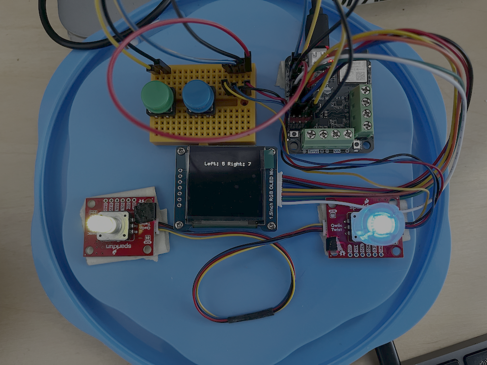

# minicontrol

At the moment this repo is about having some fun with a tiny computer and embedded rust.

## The Hardware

- __DFRobot Romeo Mini V1.0__: ESP32-C3-MINI-1 microcontroller. The romeo includes motor drivers which are not used at the moment. I just had it lying around...
- A 1.5in OLED 128x128 display (SSD1351) connected through SPI
- Two [QwiicTwist](https://www.sparkfun.com/sparkfun-qwiic-twist-rgb-rotary-encoder-breakout.html) rotary encoders connected through I2C
- Two push buttons (currently only the green is connected)

## The Software

- Written in embedded Rust based on esp-hal and [embassy](https://github.com/embassy-rs/embassy). 
- I read the [Rust on ESP Book](https://docs.espressif.com/projects/rust/book/) and [Embassy Book](https://embassy.dev/book/) to get started.
- Used `esp-generate` tool to generate the project
- The [ssd1351 crate](https://github.com/MabezDev/ssd1351) made it all possible. Surprisingly it works...
- Google Gemini was super helpful in the initial configuration code (drivers, gpio, busses, etc.). It knows everything.
- Locally-run devstral-2 and qwen3-coder models also helped with code organization and some rust questions (especially getting the types right)

## Build

Connect the microcontroller to the machine using USB and run:

`cargo run --release`

NOTE: Tested only on macOS

## TODO

Currently this doesn't do much except show the state of the rotary encoders on the OLED display. 
